  

  
  
  

 

## Hi there 👋

I'm primarily a backend developer based in Canada with a focus on system design. My background includes work in the Minecraft modding community, where I learned Java and how to use Git. I've also written software using VB.net, Python, FastAPI, and Next.js. 

Currently, I am attending university and contributing to open-source projects.

* **Core Focus:** Java, Python, TypeScript, system design
* **Interests:** Music production, math, cinema, and game design

---

## Technical Stack

**Languages**
 

**Infrastructure & Tools**
 

---

## Development Activity

  

